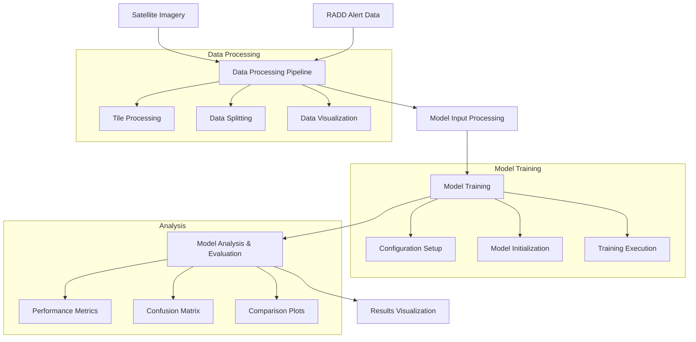

# Borneo Forest Disturbance Detection System Architecture

## System Overview

## Key Components

### 1. Data Processing Pipeline
- **Inputs**: Satellite imagery and RADD alert data
- **Processes**: Tile processing, data splitting, visualization
- **Outputs**: Processed training/validation datasets

### 2. Model Input Processing
- Handles data normalization and filtering
- Prepares input tensors for model training
- Manages statistical analysis of input data

### 3. Model Training Configuration
- Configures training parameters
- Manages optimizer and learning rate settings
- Handles transfer learning with pre-trained weights

### 4. Model Analysis & Evaluation
- Implements performance metric calculation
- Generates visualizations for model evaluation
- Provides comparison analysis between model outputs
