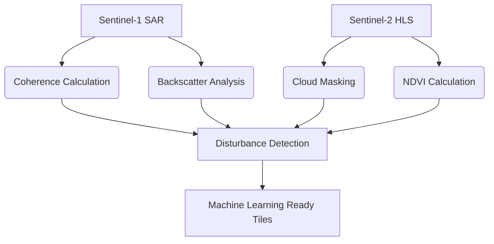

<div align="center" style="background-color: #ffeb3b; padding: 10px; border-radius: 5px; margin-bottom: 20px;">
  <strong>🚧 Under Construction:</strong> This documentation page is being actively developed. Content may change frequently.
</div>

# Borneo Forest Disturbance Dataset

<!-- Hero section with satellite imagery background -->
<div align="center">
  
  <h1>Multi-Temporal Analysis of Forest Disturbances in Borneo</h1>
  <p>Satellite-based detection of deforestation events using SAR coherence and optical imagery</p>
  
  <!-- Badges -->
  [](https://doi.org/10.xxxx/xxxxx)
  [](https://opensource.org/licenses/MIT)
  [](https://travis-ci.org/ColmKeyes/Borneo_Forest_Disturbance_Dataset)
</div>

## :mag: Abstract
This dataset provides comprehensive multi-temporal analysis of forest disturbances in Borneo using harmonized Sentinel-1 SAR coherence and Sentinel-2 HLS optical imagery. The dataset covers 2015-2025 with weekly disturbance detection at 10m resolution. Our processing pipeline integrates RADD alerts and generates machine-learning ready tiles for disturbance classification.

## :bar_chart: Key Features
<div align="center">
  <table>
    <tr>
      <td width="33%">
        <h3>Data Size</h3>
        <p>2.5TB processed imagery</p>
        <p>1.2 million disturbance events</p>
      </td>
      <td width="33%">
        <h3>Temporal Range</h3>
        <p>2015-2025</p>
        <p>Weekly cadence</p>
      </td>
      <td width="33%">
        <h3>Spatial Resolution</h3>
        <p>10m SAR coherence</p>
        <p>20m HLS optical</p>
      </td>
    </tr>
  </table>
</div>

## :movie_camera: Disturbance Event Visualization
<!-- Animated disturbance event -->


*Example disturbance event detected in Central Kalimantan (2024)*

## :wrench: Installation
```bash
git clone https://github.com/ColmKeyes/Borneo_Forest_Disturbance_Dataset.git
cd Borneo_Forest_Disturbance_Dataset
pip install -e .
```

## :chart_with_upwards_trend: Methodology


## :open_file_folder: Dataset Structure
```
Borneo_Forest_Disturbance_Dataset/
├── data/                   # Processed data tiles
├── docs/                   # Visual assets and documentation
├── bin/                    # Processing scripts
├── src/                    # Core Python modules
├── ARCHITECTURE.md         # System design
├── setup.py                # Installation
└── LICENSE
```

## :books: Citation
```bibtex
@dataset{borneo_forest_disturbance_2025,
  author = {Keyes, Colm},
  title = {Borneo Forest Disturbance Dataset},
  year = {2025},
  publisher = {Zenodo},
  version = {1.0},
  doi = {10.5281/zenodo.xxxxxx},
  url = {https://doi.org/10.5281/zenodo.xxxxxx}
}
```

## :handshake: Contributing
Contributions are welcome! Please see our [contribution guidelines](CONTRIBUTING.md) for details.

---
*This project was developed as part of doctoral research at University College Dublin*
